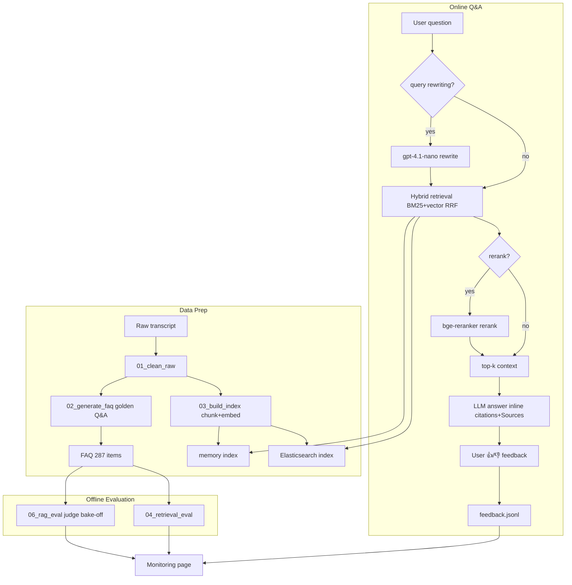
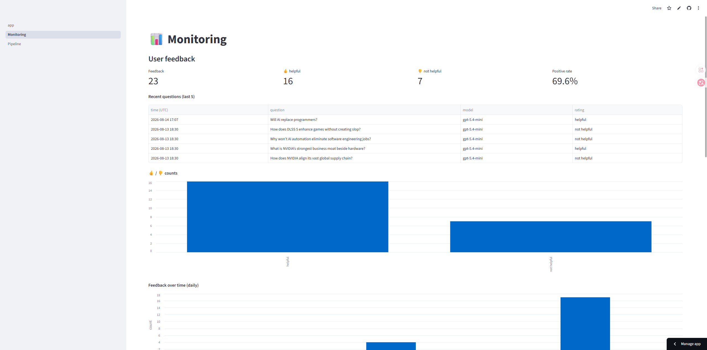
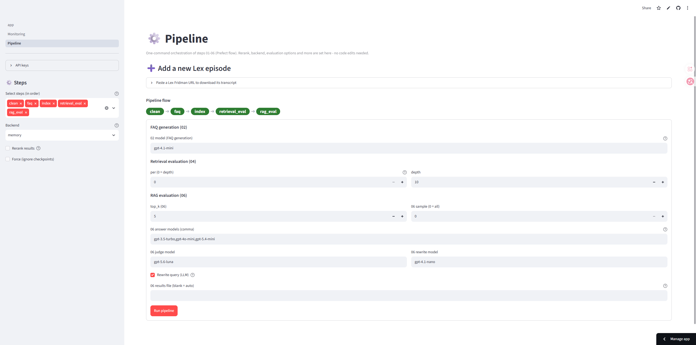
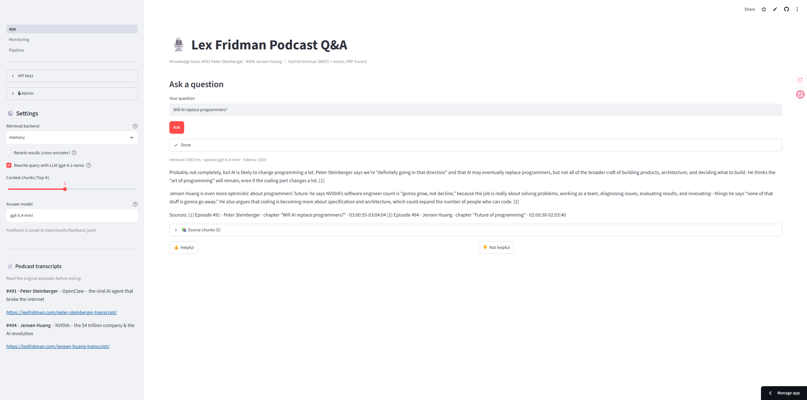

# Lex Fridman Podcast RAG Assistant

<p align="center">
  <b>English</b> · <a href="README_zh.md">中文</a>
</p>

<p align="center">
  
  
  
  
</p>

<p align="center">
  <a href="https://lex-fridman-podcast-rag-assistant-qwuleh7say6jc8qhgdvdjp.streamlit.app/">Live Demo</a> · <a href="https://github.com/QM99999/Lex-Fridman-Podcast-RAG-Assistant">GitHub</a>
</p>

A RAG question-answering assistant built on Lex Fridman podcast transcripts: ask a question and get a verifiable answer with chapter and timestamp citations, backed by retrieval evaluation, LLM-judge scoring, and a user feedback loop.

## Table of Contents

- [📌 Problem](#problem)
- [🏗️ Project Structure](#project-structure)
- [⚙️ Implementation Details](#implementation)
- [🧰 Tech Stack](#tech-stack)
- [📊 Evaluation](#evaluation)
- [🧭 Design Decisions](#design-decisions)
- [🚀 Getting Started](#getting-started)
- [🖥️ Pages](#pages)
- [💬 Usage Example](#usage-example)
- [☁️ Online Deployment](#online-deployment)
- [✅ Completed](#completed)
- [⚠️ Limitations](#limitations)
- [📄 License](#license)

## 📌 Problem <a id="problem"></a>

Podcasts are a "write-only" repository of speech: 2-4 hour episodes, hundreds of pages of transcripts, insights buried inside — impossible to search or locate, and asking an AI directly invites hallucination.

**Target users**: podcast deep-listeners and researchers who want to quickly locate the source of an opinion or compare views across episodes, without scrubbing the timeline over and over.

This assistant solves four problems:

1. **Long content is impossible to locate (the biggest pain point)**
   - You remember Jensen said "AI will replace 80% of software," but to find the original quote you have to scrub the timeline from the start
   - Traditional search doesn't work on audio; Ctrl+F on the transcript only matches literal words, so "what does he think about the future of programming?" finds nothing
   - Solution: ask directly → get an answer + episode/chapter/timestamp, locate a 30-second segment inside 2 hours of audio in about 5 seconds
2. **Hallucination and trustworthiness of AI answers**
   - A general LLM answers podcast questions by guessing, with no way to verify when it is wrong
   - Solution: force RAG retrieval of context + inline [n] citations + a Sources section (episode, chapter, time range) — answers are traceable, debatable, and verifiable
3. **Cross-podcast knowledge aggregation**
   - The project ships with 2 episodes (Peter Steinberger on OpenClaw, Jensen Huang on NVIDIA/AGI)
   - "How do both guests feel about AI replacing programmers?" would normally require listening to both episodes and comparing manually
   - Solution: one query searches both knowledge bases, and the answer gives both viewpoints with their own sources
4. **Engineering: how do we know it actually works**
   - Retrieval quality is quantified with 287 golden questions (see [Evaluation](#evaluation))
   - Answer quality is measured by an LLM judge in a 3-model bake-off
   - A user feedback loop (👍/👎) drives continuous monitoring

## 🏗️ Project Structure <a id="project-structure"></a>

### Directory & Core Files

| Path | Purpose |
|---|---|
| app.py | Streamlit home page: Q&A interface |
| pages/1_Monitoring.py | Monitoring page: feedback trends, citation distribution, response latency, etc. |
| pages/2_Pipeline.py | Pipeline page: one-click run of steps via Prefect |
| src/00_fetch_transcript.py | Fetch podcast transcripts |
| src/01_clean_raw.py | Clean raw transcripts → data/processed |
| src/02_generate_faq.py | Generate golden Q&A pairs (FAQ) → data/faq |
| src/03_build_index.py | Chunk + embed, write to memory / ES index |
| src/04_retrieval_eval.py | Retrieval evaluation (bm25 / vector / hybrid, optional rerank) |
| src/05_rag.py | Main Q&A flow: retrieval → answer with citations |
| src/06_rag_eval.py | RAG evaluation: judge scores answer models (bake-off) |
| src/07_pipeline.py | Prefect pipeline orchestration |
| src/retrieval.py | Retrieval core: index, hybrid search, rerank, query rewrite |
| src/ui_config.py | Page config: API keys, admin auth |
| data/ | Raw transcripts / processed / faq / index / evaluation results |
| docker-compose.yml | One-command start of ES + app |
| Dockerfile | App image build |

### Retrieval & Generation Flow

Question → retrieval (BM25 + vector, fused with RRF) → optional rerank → top-k context → LLM answer (inline [n] citations + Sources). Query rewriting is optional (off by default).



## ⚙️ Implementation Details <a id="implementation"></a>

### Data Preparation (00-02)

**Transcript cleaning (01_clean_raw)**
- Fetches transcript XML from the official site (#491 Peter Steinberger, #494 Jensen Huang) and parses it into structured speech segments: `speaker / timestamp / text`
- Output hierarchy: episode → chapters → segments; the guest is auto-detected as the most frequent non-host speaker
- Cleaned JSON lands in `data/processed/`, the shared source for chunking, FAQ, and citations

**FAQ generation (02_generate_faq)**
- Uses an LLM per chapter to generate golden Q&A pairs (this project uses deepseek-v4-flash, configurable via 02_MODEL), 287 total, written to `data/faq/*.faq.json`
- Each FAQ records `source_timestamps` (the timestamps the answer comes from) — the only source of ground truth for retrieval evaluation
- Design constraint: the FAQ generator is excluded from the answer-model bake-off (avoid "writing the exam you take")

### Index Building (03_build_index)

**Chunking rules**
- Chunk per chapter with a `--max-words 500` word cap, **never splitting a speech segment**: one utterance stays entirely inside a single chunk, keeping timestamp citations precise to the segment
- Chunk text = each segment as `speaker: text` joined with newlines; chunk id looks like `494-01-001` (`{episode}-{chapter:02d}-{seq:03d}`)
- Each chunk records `start_ts` / `end_ts` (first/last segment timestamps) for FAQ timestamp mapping
- Result: 135 chunks from 2 episodes

**Embedding**
- OpenAI `text-embedding-3-small`, called in batches of `EMBED_BATCH=32`
- Incremental & resumable: only embeds chunks not already in the index; reruns skip cached vectors

**Dual backends**
- memory: numpy cosine similarity (`vectors @ q / (||v|| · ||q||)`) + pure-Python Okapi BM25; vectors stored in `kb_memory.json`, zero dependencies, committed with the repo
- Elasticsearch: native BM25 (match query) + dense kNN field, production retrieval

### Retrieval (04 / 05 share src/retrieval.py)

**BM25 (keyword)**
- memory backend: pure-Python Okapi BM25 with `k1=1.5, b=0.75`; tokenization = regex extraction + lowercase
- ES backend: native ES BM25 scoring (same RRF fusion interface)

**Vector retrieval (semantic)**
- The question is encoded with the same embedding model and searched against all chunk vectors (memory: numpy cosine; ES: dense kNN)

**RRF fusion (hybrid)**
- Fuses both ranked lists: `score(d) = Σ_route 1 / (k + rank + 1)`, `k=60`
- Each route contributes `per` candidates to the fusion (04 defaults to depth, 05 defaults to 10, adjustable via `--per`), then take top-k after fusion

**Optional rerank**
- `BAAI/bge-reranker-base` cross-encoder, Xenova ONNX int8 weights (~279MB), `MAX_LENGTH=512`, onnxruntime local CPU inference — free, no API calls
- Auto-downloads and caches from HuggingFace on first use; alternatively drop `model_int8.onnx` + `tokenizer.json` into `~/.cache/lex-rag-models/bge-reranker-base/` (or point `RERANK_MODEL_DIR` there) to skip the download
- Flow: hybrid recalls `--rerank-candidates 20` candidates → cross-encoder reranks → take top-k

**Optional query rewriting (rewrite)**
- Off by default; when enabled, gpt-4.1-nano rewrites colloquial questions into retrieval-friendly complete sentences before retrieval

### Answer Generation (05_rag)

**System prompt design**
- Only allowed to answer from the provided context chunks (`Answer ONLY from the provided context chunks`)
- Enforces inline citations: `[n]` right after the sentence (matching the context order)
- If the context has no answer, explicitly say "I don't know" — no guessing
- Explicitly forbids the model from writing its own Sources section at the end — the code appends it uniformly afterwards for consistent formatting

**Sources post-processing (format_answer)**
- Regex-parses `[n]` citations from the answer → maps back to chunks → produces `[n] (Episode · guest · chapter · time range)` list
- Fallback: if the model cites nothing, list all top-k context chunks

**Runtime parameters**: `temperature=0.2`, `top_k=5`, `per=10`

### Evaluation (04 / 06)
- Methods, metric definitions, and results are detailed in the [Evaluation](#evaluation) section below; everything is reproducible from the Pipeline page.

### Engineering & Deployment
- Prefect pipeline: clean → faq → index → retrieval_eval → rag_eval, one-click from the page, incremental and resumable
- Monitoring page: feedback trends, citation distribution, answer length, top keywords, recent questions
- Admin auth (Monitoring/Pipeline pages), session-scoped API keys; Docker Compose for local one-command start, Streamlit Cloud for online deployment

## 🧰 Tech Stack <a id="tech-stack"></a>

| Category | Tech | Notes |
|---|---|---|
| Language | Python 3.12 | Entire project |
| Web UI | Streamlit | Three pages: Q&A, Monitoring, Pipeline |
| Orchestration | Prefect 3 | One-click clean/faq/index/eval from the Pipeline page |
| Retrieval backend | Elasticsearch 8.14 (Docker) | Production retrieval: BM25 + dense kNN + RRF fusion |
| Retrieval backend | In-memory index (kb_memory.json) | Zero-dependency lightweight backend for cloud / no-Docker environments |
| Embedding model | OpenAI text-embedding-3-small | chunk / query embedding |
| Answer models | gpt-3.5-turbo / gpt-4o-mini / gpt-5.4-mini | Q&A (bake-off picks the default) |
| Judge model | gpt-5.6-luna | Evaluation scoring |
| Rewrite model | gpt-4.1-nano | query rewriting (off by default) |
| Rerank model | BAAI/bge-reranker-base (ONNX) | Local CPU reranking, free, no API calls |
| Local inference | onnxruntime + tokenizers + huggingface-hub | ONNX runtime, tokenizer, auto model download & cache |
| Optional provider | DeepSeek API | Alternative for deepseek-* models |
| Web scraping | httpx + lxml | Fetch and parse official transcript XML/HTML |
| Data processing | pandas / numpy | Evaluation stats, feedback aggregation |
| Structured output | pydantic | Structured LLM output (e.g., judge scores) |
| Deployment | Docker Compose / Streamlit Cloud | Local one-command start / cloud hosting |
| Dev tools | Git / VS Code / Docker Desktop | Development environment |

## 📊 Evaluation <a id="evaluation"></a>

All evaluations are reproducible from the Pipeline page. The project uses only two episodes as test data: Peter Steinberger (#491) and Jensen Huang (#494), sourced from <https://lexfridman.com/podcast>. Evaluation data ships with the repo: golden questions in `data/faq/`, result files in `data/results/`.

> A full evaluation (287 questions × 3 models) takes about 15 minutes and incurs LLM API costs; results are cached and resumable, and only re-run when parameters change (see Reproducibility under each method).

**Evaluation method**

**Retrieval evaluation (04)**

1. **Golden questions & ground truth**: loads 287 questions from the FAQ (data/faq); each question's gold chunk is the chunk its FAQ source timestamps fall into (mapped via the index built by 03)
2. **Retrieval**: each question is retrieved with three methods:
   - bm25: keyword matching, take the top-depth results
   - vector: embed the question, nearest-neighbor search, take the top-depth results
   - hybrid: bm25 + vector results fused with RRF (optionally: recall 20 candidates, rerank with bge-reranker)
3. **Metrics** (averaged over all questions):
   - hit@k (k=1,3,5): fraction of questions where any gold chunk appears in the top-k results
   - MRR: mean reciprocal rank of the first gold chunk
   - recall@10: fraction of gold chunks appearing in the top-10 results
4. **Reproducibility**: results are resumable per faq_id; the cache is invalidated when backend / depth / ks change.

**Answer evaluation (06)**

1. **Data**: the same 287 questions, with the FAQ answers as ground truth
2. **Flow** (per question × per answer model):
   - optional: gpt-4.1-nano rewrites the question (results cached in rewritten_queries.json)
   - retrieve top-5 context (hybrid retrieval)
   - the answer model generates the answer
   - the judge gpt-5.6-luna (pydantic structured output `reasoning + score(good|bad)`) compares against the ground truth: no verbatim match required, but it must convey the same key information; extra detail is allowed; bad only when wrong or missing key points; concurrent `BATCH=8` batches to control rate
3. **Aggregation**: good rate per model, the best model is auto-set as the default answer model (updates 05_MODEL); rewrite on/off runs as a comparison; partial runs support stratified random sampling by episode ratio (fixed seed, reproducible)
4. **Reproducibility**: results cached per (faq_id, answer_model); invalidated when backend / top_k / judge model change.

**Model roles & fairness**

Evaluation involves four model roles; to keep it fair, each role uses a different model:

| Role | Model | Purpose |
|---|---|---|
| Answer (athlete) | gpt-3.5-turbo / gpt-4o-mini / gpt-5.4-mini | Answer models being evaluated |
| Judge | gpt-5.6-luna | Scores answers good/bad |
| Rewrite | gpt-4.1-nano | Query rewriting (off by default) |
| FAQ generation | deepseek-v4-flash | Source of golden questions |

Constraint: the judge never answers; the FAQ generator (deepseek) never enters the answer bake-off; the rewrite model is independent from the answer/judge models — no "grading your own exam."

### 1. Retrieval Evaluation 04: Three Methods + rerank Comparison

<details>
<summary>Full output</summary>

```text
[1/1 retrieval_eval] $ /usr/local/bin/python3.12 /app/src/04_retrieval_eval.py --backend elasticsearch --depth 10 --ks 1,3,5 --rerank-model BAAI/bge-reranker-base --rerank-candidates 20
artifact: 135 chunks (embedding_model=text-embedding-3-small)
backend: elasticsearch lex_fridman @ http://elasticsearch:9200
reranker: BAAI/bge-reranker-base (candidates=20)
golden queries: 287 total, 250 cached, 37 to evaluate
  checkpoint: 275/287 evaluated
done evaluating 37 new queries
saved results -> /app/data/results/retrieval_eval_es_d10_p10_k1-3-5_rerank-BAAI-bge-reranker-base.json

retrieval evaluation on 287 queries (k=[1, 3, 5], depth=10):
method   hit@1  hit@3  hit@5     MRR   recall@10
bm25      0.578   0.780   0.847   0.692       0.868
vector    0.551   0.739   0.815   0.658       0.858
hybrid    0.613   0.836   0.895   0.731       0.905
hybrid+rerank  0.582   0.794   0.833   0.693       0.880
```

</details>

**Parameters**
- `--backend elasticsearch`: evaluate retrieval on the ES backend (optional memory comparison)
- `--depth 10`: candidate recall depth per question (matches recall@10)
- `--ks 1,3,5`: compute hit@1 / hit@3 / hit@5
- `--rerank-model BAAI/bge-reranker-base`: enable bge-reranker reranking (local ONNX, no API cost)
- `--rerank-candidates 20`: recall 20 candidates first, then rerank for the final results

**Results**
- hybrid (BM25 + vector fusion) beats either single method: the highest hit@5 0.895 and recall@10 0.905
- Adding bge-reranker slightly lowers every metric (hit@5 0.833, recall@10 0.880): with only 135 chunks, hybrid is already accurate enough; reranking adds latency without benefit — keep it off for small corpora

### 2. RAG Evaluation 06: Answer Model Bake-off (No Rewrite vs Rewrite)

No rewrite (`--rewrite none`, control):

<details>
<summary>Full output (no rewrite)</summary>

```text
[1/1 rag_eval] $ /usr/local/bin/python3.12 /app/src/06_rag_eval.py --backend elasticsearch --top-k 5 --rewrite none --rewrite-model gpt-4.1-nano --answer-models gpt-3.5-turbo,gpt-4o-mini,gpt-5.4-mini --judge-model gpt-5.6-luna
results file: /app/data/results/rag_eval_es_k5_norw_judge-gpt-5.6-luna.json
records: 287 | answer models: gpt-3.5-turbo, gpt-4o-mini, gpt-5.4-mini | judge: gpt-5.6-luna | backend: elasticsearch | top_k: 5 | rewrite: none
items: 861 total, 861 cached, 0 to evaluate

answer model           good  bad failed good_rate
gpt-3.5-turbo           191   96      0     66.6%
gpt-4o-mini             228   59      0     79.4%
gpt-5.4-mini            240   47      0     83.6%

best answer model: gpt-5.4-mini (83.6% good)
```

</details>

With rewrite (`--rewrite llm`, treatment):

<details>
<summary>Full output (with rewrite)</summary>

```text
[1/1 rag_eval] $ /usr/local/bin/python3.12 /app/src/06_rag_eval.py --backend elasticsearch --top-k 5 --rewrite llm --rewrite-model gpt-4.1-nano --answer-models gpt-3.5-turbo,gpt-4o-mini,gpt-5.4-mini --judge-model gpt-5.6-luna
rewritten queries: 287 cached -> /app/data/results/rewritten_queries.json
results file: /app/data/results/rag_eval_es_k5_rw-gpt-4.1-nano_judge-gpt-5.6-luna.json
records: 287 | answer models: gpt-3.5-turbo, gpt-4o-mini, gpt-5.4-mini | judge: gpt-5.6-luna | backend: elasticsearch | top_k: 5 | rewrite: llm (gpt-4.1-nano)
items: 861 total, 861 cached, 0 to evaluate

answer model           good  bad failed good_rate
gpt-3.5-turbo           180  107      0     62.7%
gpt-4o-mini             217   70      0     75.6%
gpt-5.4-mini            235   52      0     81.9%

best answer model: gpt-5.4-mini (81.9% good)
```

</details>

**Parameters**
- `--backend elasticsearch`: retrieve on the ES backend
- `--top-k 5`: pass the top-5 chunks to the LLM after retrieval
- `--answer-models gpt-3.5-turbo,gpt-4o-mini,gpt-5.4-mini`: the 3 answer models (athletes) to evaluate
- `--judge-model gpt-5.6-luna`: LLM judge that scores each answer good/bad
- `--rewrite none`: no query rewriting (the original question goes straight to retrieval)
- `--rewrite llm`: rewrite the question with `--rewrite-model` before retrieval (treatment)
- `--rewrite-model gpt-4.1-nano`: lightweight model that rewrites questions

**Results**
- No rewrite: gpt-5.4-mini (83.6%) > gpt-4o-mini (79.4%) > gpt-3.5-turbo (66.6%); gpt-5.4-mini becomes the default answer model
- With rewrite: all three models got worse (81.9% / 75.6% / 62.7%); FAQ questions are already complete, retrieval-friendly sentences, so rewriting adds noise and drops keywords — query rewriting stays off by default

## 🧭 Design Decisions <a id="design-decisions"></a>

- **Hybrid retrieval over a single method**: bm25 excels at exact keyword matching, vectors at semantic matching; RRF fusion combines the best of both (evaluation shows every metric beats single methods, see [Evaluation](#evaluation))
- **Query rewriting off by default**: FAQ questions are already retrieval-friendly complete sentences; rewriting actually lowers accuracy (see [Evaluation](#evaluation))
- **Rerank off by default**: at the current corpus size hybrid is accurate enough; reranking adds latency with little benefit (see [Evaluation](#evaluation))
- **Dual backends (memory / Elasticsearch)**: memory is zero-dependency and committed with the repo, great for the cloud and quick onboarding; ES provides production-grade BM25+kNN for local use and scaling; both share the same data and yield identical evaluation results
- **Default answer model gpt-5.4-mini**: bake-off winner at a lower cost than larger models
- **Chunk per chapter (500-word cap)**: keeps semantics intact and aligns citation granularity with podcast chapters

## 🚀 Getting Started <a id="getting-started"></a>

> Please create a NEW API key for testing and deactivate it when you are done!
> API keys are only stored in the local .env and browser session (auto-cleared after 24 hours, never uploaded) and can be deleted anytime from the page.
> Testers: just open the app and fill in your key in the sidebar — no need to edit .env manually.

1. **Install dependencies**
   ```bash
   pip install -r requirements.txt
   ```
2. **Copy the env file**
   ```bash
   cp .env.example .env
   ```

Key environment variables:

| Variable | Description | Default |
|---|---|---|
| OPENAI_API_KEY | OpenAI API key (required) | - |
| DEEPSEEK_API_KEY | DeepSeek key (optional, for deepseek-* models) | - |
| 02_MODEL | FAQ generation model | gpt-4o-mini |
| 03_EMBEDDING_MODEL | Embedding model | text-embedding-3-small |
| 05_MODEL | Answer model | gpt-5.4-mini |
| 06_JUDGE_MODEL | Evaluation judge model | gpt-5.6-luna |
| ES_URL | Elasticsearch URL | http://localhost:9200 |
| ADMIN_PASSWORD | Admin password for Monitoring/Pipeline pages | admin1 |

3. **Start the app**
   - memory backend:
     ```bash
     python -m streamlit run app.py
     ```
   - elasticsearch backend (requires Docker): build the index once before the first start; no need afterwards
     ```bash
     docker compose run --rm app python src/03_build_index.py --backend elasticsearch
     ```
     Then start everything:
     ```bash
     docker compose up -d
     ```
     Note: `docker compose down -v` deletes the ES data volume and the index with it — re-run the index command above.

The app runs at http://localhost:8501/.

- 9200 is Elasticsearch's HTTP REST API port
- 8501 is Streamlit's port

## 🖥️ Pages <a id="pages"></a>

The app has 3 pages, switchable via the left navigation after startup:

### Q&A Page (App)

- Sidebar settings: backend (memory / elasticsearch), rerank toggle, query rewriting toggle, answer model
- Ask a question and get an answer with [n] citations and a Sources section; 👍/👎 feedback under each answer
- The sidebar manages API keys (OpenAI required) and lists the current podcasts with links

### Monitoring Page

- Admin-only, shows usage:
- Recent 5 questions, 👍/👎 counts and daily trend
- Citation distribution by episode, top keywords, answer-length distribution
> The current 👍/👎 data is sample data and does not reflect real model performance.



### Pipeline Page

- Admin-only, runs the data pipeline with one click:
- Add a new podcast by pasting a Lex Fridman -transcript page URL
- Check steps: clean / faq / index / retrieval_eval / rag_eval; each can run independently
- Configure: backend, rerank, evaluation settings (04/06); results saved to data/results/
- Live progress with the option to abort the running pipeline



## 💬 Usage Example <a id="usage-example"></a>

Ask directly on the Q&A page; below is a real Q&A excerpt:

**Question**: What was the story of the one-hour prototype?

**Answer**:
> The one-hour prototype was very simple: Peter hooked WhatsApp up to Claude Code with a CLI call, so when a message came in, he passed it to the CLI, got the string response back, and sent that back to WhatsApp. He built that in about an hour and felt like he could "talk to my computer" for the first time. [3]

**Sources** (partial):
- [3] (Episode 491 · Peter Steinberger · chapter "Mind-blowing moment" · 00:08:55-00:10:52)

Retrieval spans both episodes: the top-5 context in this example contains chunks from both Peter (#491) and Jensen (#494), so the answer can cite across episodes.



## ☁️ Online Deployment <a id="online-deployment"></a>

Live at https://lex-fridman-podcast-rag-assistant-qwuleh7say6jc8qhgdvdjp.streamlit.app/

The cloud backend only supports memory; the admin password is admin1 (for testing).

## ✅ Completed <a id="completed"></a>

| Requirement | Status |
|---|---|
| Problem statement | ✅ Podcast content is "write-only": long-form content is hard to locate, direct AI Q&A hallucinates, cross-episode comparison is hard; this assistant provides verifiable Q&A with chapter/timestamp citations |
| Retrieval pipeline | ✅ Knowledge base (hybrid BM25+vector RRF) + LLM generation with citations |
| Retrieval evaluation | ✅ bm25 / vector / hybrid compared (incl. rerank), best hybrid selected |
| LLM evaluation | ✅ 3-model answer bake-off, winner gpt-5.4-mini set as default |
| UI | ✅ Streamlit Q&A app (plus Monitoring and Pipeline pages) |
| Data ingestion | ✅ Prefect automated pipeline (clean → faq → index → eval) |
| Monitoring | ✅ User 👍/👎 feedback + monitoring page (multiple charts) |
| Containerization | ✅ Docker Compose with ES + app |
| Reproducibility | ✅ Pinned dependencies (requirements.txt), data committed, full run instructions in README |
| Hybrid retrieval | ✅ Implemented and evaluated |
| Document reranking | ✅ bge-reranker implemented and evaluated |
| Query rewriting | ✅ gpt-4.1-nano rewrite implemented with comparative evaluation |
| Cloud deployment | ✅ Streamlit Cloud live deployment |

## ⚠️ Limitations <a id="limitations"></a>

- Limited corpus: only 2 episodes, 135 chunks; conclusions are based on a small corpus and need re-validation when more episodes are added
- Depends on official transcript pages: automatic transcription errors may affect retrieval and citation accuracy

**Data & storage**
- Storage relies on single JSON files (`kb_memory.json`, `data/results/*.json`, `feedback.jsonl`): no transactions, no indexes; reads/writes slow down as data grows and concurrent feedback writes can be lost; scaling should migrate to a database (ES already qualifies, but the memory backend, feedback, and result files remain database-free)
- The memory backend loads all vectors into RAM and scans with numpy, with no ANN index: query latency grows linearly as chunks go from 135 to 100k+; it needs approximate nearest neighbors (HNSW/IVF) — ES dense kNN already uses HNSW, but the memory backend does not
- Result files are scattered under `data/results/` named by parameters, without unified metadata/version management; historical results are hard to trace after reruns with different configs

**Evaluation trustworthiness**
- Ground truth (287 FAQ items) is LLM-generated rather than human-annotated, so scores may carry systematic bias; the judge is also an LLM (gpt-5.6-luna) with no agreement check against human ratings (e.g., Cohen's kappa)
- The judge score is binary good/bad, unable to capture "partially correct"; evaluation focuses on retrieval hit rates and binary answer classification, without answer-level faithfulness (hallucination rate)

**Performance & cost**
- The 06 evaluation calls external APIs in sequential batches (861 items ≈ 15 min); time and API cost grow linearly with corpus or model count; rerank is local CPU inference with high latency, unsuitable for high-concurrency online serving

**Engineering maturity**
- No automated tests or CI; changes rely on manual verification; Prefect uses a temporary server with no persisted run history

## 📄 License <a id="license"></a>

Podcast transcripts are copyright Lex Fridman; this project is for educational purposes only.

- Code is open-sourced under the MIT License (see [LICENSE](LICENSE))
