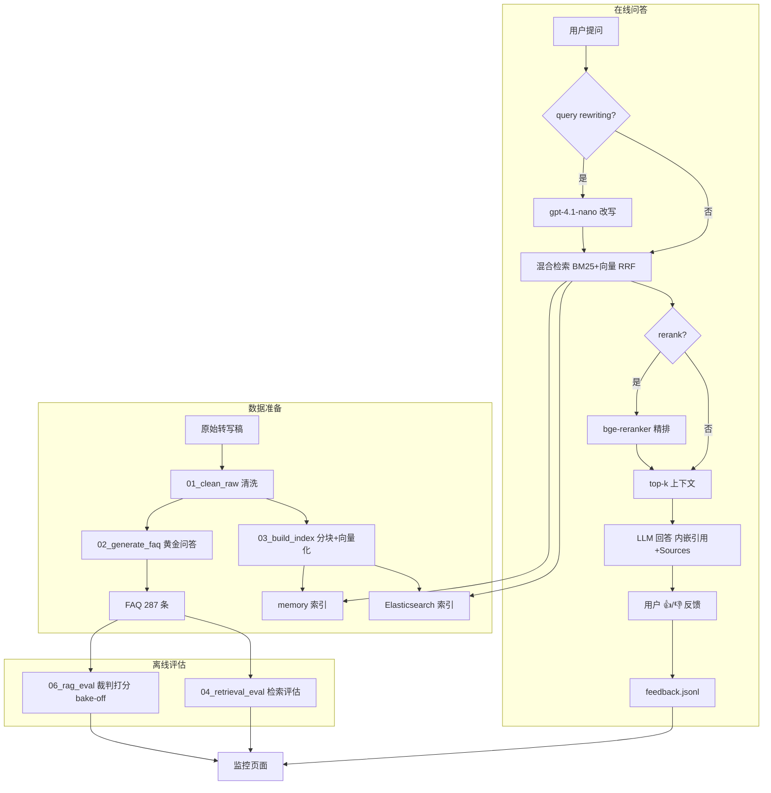

# Lex Fridman Podcast RAG Assistant

<p align="center">
  <a href="README.md">English</a> · <b>中文</b>
</p>

<p align="center">
  
  
  
  
</p>

<p align="center">
  <a href="https://lex-fridman-podcast-rag-assistant-qwuleh7say6jc8qhgdvdjp.streamlit.app/">在线演示</a> · <a href="https://github.com/QM99999/Lex-Fridman-Podcast-RAG-Assistant">GitHub</a>
</p>

一个基于 Lex Fridman 播客转写稿的 RAG 问答助手：直接提问，返回带章节和时间戳引用的可验证答案，并用检索评估、LLM 裁判评分和用户反馈闭环来保证质量。

## 目录

- [📌 问题](#问题)
- [🏗️ 项目结构](#项目结构)
- [⚙️ 实现细节](#实现细节)
- [🧰 技术栈](#技术栈)
- [📊 评估](#评估)
- [🧭 设计决策](#设计决策)
- [🚀 运行方式](#运行方式)
- [🖥️ 页面说明](#页面说明)
- [💬 使用示例](#使用示例)
- [☁️ 在线部署](#在线部署)
- [✅ 已完成](#已完成)
- [⚠️ 局限性](#局限性)
- [📄 版权声明](#版权声明)

## 📌 问题 <a id="问题"></a>

播客是"只进不出"的语音仓库：动辄 2-4 小时、几百页转写稿，观点藏在里面，但用户既没法搜、也没法定位，AI 直接问又会幻觉。

**目标用户**：播客深度听众与研究者——想快速定位观点出处、跨集对比嘉宾观点，而不愿反复拖进度条的人。

本助手解决了四个问题：

1. **长内容无法定位（最痛的点）**
   - 听播客记住了一句"Jensen 说 AI 会替代 80% 的软件"，但要找原始出处，只能从头拖进度条
   - 传统搜索对音频无效；转写稿 Ctrl+F 也只能匹配字面词，问"他对编程未来的看法"搜不到
   - 项目解法：直接提问 → 返回答案 + episode/章节/时间戳，5 秒定位到 2 小时音频里的 30 秒片段
2. **AI 回答的幻觉与可信度**
   - 通用 LLM 答播客内容靠猜，错了也没法验证
   - 项目解法：强制 RAG 检索上下文 + 回答内嵌 [n] 引用 + Sources 段落（哪一集、哪个章节、什么时间段）——答案可溯源、可反驳、可验证
3. **跨播客的知识聚合**
   - 项目有 2 集（Peter Steinberger 谈 OpenClaw、Jensen Huang 谈 NVIDIA/AGI）
   - 问"两位嘉宾怎么看 AI 取代程序员？"传统方式要分别听完两集再自己对比
   - 项目解法：一次检索两个知识库，答案里给出两边的观点和各自出处
4. **工程层面：怎么保证它真的有用**
   - 检索质量用 287 个黄金问题量化（详见「评估」）
   - 回答质量用 LLM 裁判对 3 个模型打分的 bake-off
   - 用户反馈闭环（👍/👎）驱动持续监控

## 🏗️ 项目结构 <a id="项目结构"></a>

### 目录与核心文件

| 路径 | 作用 |
|---|---|
| app.py | Streamlit 主页：问答界面 |
| pages/1_Monitoring.py | 监控页：反馈趋势、引用分布、响应延迟等 |
| pages/2_Pipeline.py | 流水线页：Prefect 一键跑各步骤 |
| src/00_fetch_transcript.py | 拉取播客转写稿 |
| src/01_clean_raw.py | 清洗原始转写稿 → data/processed |
| src/02_generate_faq.py | 生成黄金问答对（FAQ）→ data/faq |
| src/03_build_index.py | 分块 + 向量化，写入 memory / ES 索引 |
| src/04_retrieval_eval.py | 检索评估（bm25 / vector / hybrid，可选 rerank） |
| src/05_rag.py | 问答主流程：检索 → 生成带引用的回答 |
| src/06_rag_eval.py | RAG 评估：裁判对多个回答模型打分（bake-off） |
| src/07_pipeline.py | Prefect 流水线编排 |
| src/retrieval.py | 检索核心：索引、混合检索、rerank、query 改写 |
| src/ui_config.py | 页面配置：API key、管理员权限 |
| data/ | 原始转写稿 / processed / faq / 索引 / 评估结果 |
| docker-compose.yml | 一键启动 ES + app |
| Dockerfile | app 镜像构建 |

### 检索与生成流程

问题 → 检索（BM25 + 向量，RRF 融合）→ 可选 rerank 精排 → top-k 上下文 → LLM 回答（内嵌 [n] 引用 + Sources 段落）。query rewriting 可选（默认关闭）。




## ⚙️ 实现细节 <a id="实现细节"></a>

### 数据准备（00-02）

**转写稿清洗（01_clean_raw）**
- 从官网拉取转写稿 XML（#491 Peter Steinberger、#494 Jensen Huang），解析为结构化发言段：`speaker / timestamp / text`
- 输出层级：episode → chapters → segments；按"非主持人中出现次数最多"自动识别嘉宾
- 清洗后的 JSON 落在 `data/processed/`，是分块、FAQ 与引用的共同数据源

**FAQ 生成（02_generate_faq）**
- 按章节用 LLM 生成黄金问答对（本项目实际使用 deepseek-v4-flash，可用 02_MODEL 配置），共 287 条，写入 `data/faq/*.faq.json`
- 每条 FAQ 记录 `source_timestamps`（回答出处的时间戳列表）——这是检索评估 ground truth 的唯一来源
- 设计约束：FAQ 生成者被排除出回答模型对比（避免"自己出题自己答"）

### 索引构建（03_build_index）

**分块规则**
- 按章节分块，`--max-words 500` 词数上限，**绝不切分发言段**：一条发言完整落入单个 chunk，保证时间戳引用精确到段
- chunk 文本 = 各段 `speaker: text` 换行拼接；chunk id 形如 `494-01-001`（`{episode}-{章节:02d}-{序号:03d}`）
- 每个 chunk 记录 `start_ts` / `end_ts`（首段/末段时间戳），供 FAQ 时间戳映射
- 结果：2 集共 135 个 chunk

**向量化**
- OpenAI `text-embedding-3-small`，批量 `EMBED_BATCH=32` 调用
- 增量与断点：只嵌入"不在索引中"的新 chunk，重跑命中已存向量直接跳过

**双后端**
- memory：numpy 余弦相似度（`vectors @ q / (||v|| · ||q||)`）+ 纯 Python Okapi BM25，向量存 `kb_memory.json`，零依赖、随仓库提交
- Elasticsearch：原生 BM25（match query）+ dense kNN 字段，生产检索

### 检索（04 / 05 共用 src/retrieval.py）

**BM25（关键词）**
- memory 端为纯 Python Okapi BM25：`k1=1.5, b=0.75`；词元化 = 正则提取 + 小写
- ES 端直接用 ES 原生 BM25 评分（同一套 RRF 融合接口）

**向量检索（语义）**
- 问题用同一嵌入模型编码，与全部 chunk 向量求最近邻（memory：numpy 余弦；ES：dense kNN）

**RRF 融合（hybrid）**
- 两路排序结果融合：`score(d) = Σ_route 1 / (k + rank + 1)`，`k=60`
- 每路取 `per` 个候选进入融合（04 默认与 depth 相同、05 默认 10，可 `--per` 调整），融合后取 top-k

**可选精排（rerank）**
- `BAAI/bge-reranker-base` 交叉编码器，Xenova ONNX int8 权重（约 279MB），`MAX_LENGTH=512`，onnxruntime 本地 CPU 推理——免费、无 API 调用
- 首次使用自动从 HuggingFace 下载并缓存；也可手动把 `model_int8.onnx` + `tokenizer.json` 放入 `~/.cache/lex-rag-models/bge-reranker-base/`（或 `RERANK_MODEL_DIR` 指定目录）跳过下载
- 流程：hybrid 召回 `--rerank-candidates 20` 个候选 → 交叉编码器重排 → 取 top-k

**可选查询改写（rewrite）**
- 默认关闭；开启时用 gpt-4.1-nano 把口语化问题改写成检索友好的完整问句，再进入检索

### 问答生成（05_rag）

**System prompt 设计**
- 只允许依据提供的上下文 chunk 回答（`Answer ONLY from the provided context chunks`）
- 强制内嵌引用：句子后紧跟 `[n]`（对应上下文序号）
- 上下文不含答案时明确说明"不知道"，禁止猜测
- 明确禁止模型在正文末尾自己写 Sources 段——由代码统一后处理附加，保证格式一致

**Sources 后处理（format_answer）**
- 正则解析回答中的 `[n]` 引用 → 映射回对应 chunk → 生成 `[n] (Episode · guest · chapter · 时间段)` 列表
- 兜底：若模型一个都没引用，则列出全部 top-k 上下文

**运行时参数**：`temperature=0.2`、`top_k=5`、`per=10`

### 评估（04 / 06）
- 评估方法、指标定义与结果详见下方「评估」章节，全部可在 pipeline 页面复现。

### 工程化与部署
- Prefect 流水线：clean → faq → index → retrieval_eval → rag_eval，页面一键执行，支持增量与断点续跑
- 监控页：反馈趋势、引用分布、问答长度、高频词、最近提问等
- 管理员权限（监控/流水线页）、API key 会话级保存；Docker Compose 本地一键起，Streamlit Cloud 在线部署

## 🧰 技术栈 <a id="技术栈"></a>

| 类别 | 技术 | 说明 |
|---|---|---|
| 语言 | Python 3.12 | 全项目 |
| Web UI | Streamlit | 问答、监控、流水线三个页面 |
| 任务编排 | Prefect 3 | 流水线页面一键跑 clean/faq/index/eval |
| 检索后端 | Elasticsearch 8.14（Docker） | 生产检索：BM25 + dense kNN + RRF 融合 |
| 检索后端 | 内存索引（kb_memory.json） | 零依赖轻量后端，适用云端/无 Docker 环境 |
| 向量模型 | OpenAI text-embedding-3-small | chunk / query 嵌入 |
| 回答模型 | gpt-3.5-turbo / gpt-4o-mini / gpt-5.4-mini | 问答（bake-off 选出默认） |
| 裁判模型 | gpt-5.6-luna | 评估打分 |
| 改写模型 | gpt-4.1-nano | query rewriting（默认关闭） |
| 重排模型 | BAAI/bge-reranker-base（ONNX） | 本地 CPU 精排，免费无 API 调用 |
| 本地推理 | onnxruntime + tokenizers + huggingface-hub | ONNX 推理引擎、分词器、模型自动下载与缓存 |
| 可选提供方 | DeepSeek API | deepseek-* 模型备选 |
| 网页抓取 | httpx + lxml | 拉取并解析官网转写稿 XML/HTML |
| 数据处理 | pandas / numpy | 评估统计、反馈聚合 |
| 结构化输出 | pydantic | 裁判打分等 LLM 结构化输出 |
| 部署 | Docker Compose / Streamlit Cloud | 本地一键起 / 云端托管 |
| 开发工具 | Git / VS Code / Docker Desktop | 开发环境 |

## 📊 评估 <a id="评估"></a>

所有评估均可在 pipeline 页面复现。本项目仅使用 Peter Steinberger（#491）和 Jensen Huang（#494）两集播客作为测试数据，数据来源：<https://lexfridman.com/podcast>。评估数据随仓库提供：黄金问题在 `data/faq/`，结果文件在 `data/results/`。

> 全量评估（287 条 × 3 个模型）约需 15 分钟并产生 LLM API 费用；评估结果有缓存与断点续跑，只有参数变化时才重跑（见各方法「可复现性」）。

**评估方法**

**检索评估（04）**

1. **黄金问题与 ground truth**：从 FAQ（data/faq）加载 287 条问题；每条问题的标准 chunk 为该 FAQ 条目来源时间戳所落的 chunk（按 03 建立的索引映射）
2. **检索**：对每个问题分别用三种方法检索：
   - bm25：关键词匹配，取前 depth 个结果
   - vector：问题向量化后辑近搜索，取前 depth 个结果
   - hybrid：bm25 与 vector 结果经 RRF 融合（可选：先取 20 个候选，bge-reranker 精排）
3. **指标**（对全部问题求平均）：
   - hit@k（k=1,3,5）：前 k 个结果中是否包含任一标准 chunk 的比例
   - MRR：第一个标准 chunk 排名倒数的平均值
   - recall@10：标准 chunk 出现在前 10 个结果中的比例
4. **可复现性**：结果按 faq_id 断点续跑；backend / depth / ks 变化时缓存失效重算。

**回答评估（06）**

1. **数据**：同样的 287 条问题，以 FAQ 的标准答案作为 ground truth
2. **流程**（每条问题 × 每个回答模型）：
   - 可选：gpt-4.1-nano 改写问题（结果缓存于 rewritten_queries.json）
   - 检索 top-5 上下文（混合检索）
   - 回答模型生成回答
   - 裁判 gpt-5.6-luna（pydantic 结构化输出 `reasoning + score(good|bad)`）对照标准答案判定 good / bad：不需逐字一致，但必须传达相同关键信息；允许额外细节；仅当答错或漏关键点时判 bad；并发 `BATCH=8` 批量调用控制速率
3. **聚合**：统计每个模型的 good rate，最优者自动设为默认回答模型（更新 05_MODEL）；rewrite 开/关各跑一轮作对照；部分运行支持按 episode 比例分层随机采样（固定 seed 可复现）
4. **可复现性**：结果按 (faq_id, answer_model) 缓存；backend / top_k / 裁判模型变化时失效重跑。


**模型角色与公平性**

评估涉及四个模型角色，为保证公平，各角色使用不同模型：

| 角色 | 模型 | 用途 |
|---|---|---|
| 运动员（answer） | gpt-3.5-turbo / gpt-4o-mini / gpt-5.4-mini | 被评估的回答模型 |
| 裁判（judge） | gpt-5.6-luna | 对回答打 good/bad |
| 改写（rewrite） | gpt-4.1-nano | 问题改写（默认关闭） |
| FAQ 生成 | deepseek-v4-flash | 黄金问题来源 |

约束：裁判不参与回答；FAQ 的生成者（deepseek）不进入运动员对比；改写模型与运动员/裁判相互独立——避免“自己评自己”。

### 1. 检索评估 04：三种检索方法 + rerank 对比

<details>
<summary>查看完整输出</summary>

```text
[1/1 retrieval_eval] $ /usr/local/bin/python3.12 /app/src/04_retrieval_eval.py --backend elasticsearch --depth 10 --ks 1,3,5 --rerank-model BAAI/bge-reranker-base --rerank-candidates 20
artifact: 135 chunks (embedding_model=text-embedding-3-small)
backend: elasticsearch lex_fridman @ http://elasticsearch:9200
reranker: BAAI/bge-reranker-base (candidates=20)
golden queries: 287 total, 250 cached, 37 to evaluate
  checkpoint: 275/287 evaluated
done evaluating 37 new queries
saved results -> /app/data/results/retrieval_eval_es_d10_p10_k1-3-5_rerank-BAAI-bge-reranker-base.json

retrieval evaluation on 287 queries (k=[1, 3, 5], depth=10):
method   hit@1  hit@3  hit@5     MRR   recall@10
bm25      0.578   0.780   0.847   0.692       0.868
vector    0.551   0.739   0.815   0.658       0.858
hybrid    0.613   0.836   0.895   0.731       0.905
hybrid+rerank  0.582   0.794   0.833   0.693       0.880
```

</details>

**参数说明**
- `--backend elasticsearch`：在 ES 后端上评估检索（可选 memory 对比）
- `--depth 10`：每个问题的候选召回深度（对应 recall@10）
- `--ks 1,3,5`：计算 hit@1 / hit@3 / hit@5 命中率
- `--rerank-model BAAI/bge-reranker-base`：启用 bge-reranker 重排序（本地 ONNX 运行，不花 API 费用）
- `--rerank-candidates 20`：先召回 20 个候选，再精排取最终结果

**结果说明**
- hybrid（BM25 + 向量融合）整体优于单一检索：hit@5 0.895、recall@10 0.905 均为最高
- 加入 bge-reranker 后各项指标反而略降（hit@5 0.833、recall@10 0.880）：当前语料仅 135 个 chunk，hybrid 已足够准，重排收益不明显且增加延迟——小语料下建议关闭

### 2. RAG 评估 06：运动员 bake-off（无改写 vs 有改写）

无改写（`--rewrite none`，对照实验）：

<details>
<summary>无改写完整输出</summary>

```text
[1/1 rag_eval] $ /usr/local/bin/python3.12 /app/src/06_rag_eval.py --backend elasticsearch --top-k 5 --rewrite none --rewrite-model gpt-4.1-nano --answer-models gpt-3.5-turbo,gpt-4o-mini,gpt-5.4-mini --judge-model gpt-5.6-luna
results file: /app/data/results/rag_eval_es_k5_norw_judge-gpt-5.6-luna.json
records: 287 | answer models: gpt-3.5-turbo, gpt-4o-mini, gpt-5.4-mini | judge: gpt-5.6-luna | backend: elasticsearch | top_k: 5 | rewrite: none
items: 861 total, 861 cached, 0 to evaluate

answer model           good  bad failed good_rate
gpt-3.5-turbo           191   96      0     66.6%
gpt-4o-mini             228   59      0     79.4%
gpt-5.4-mini            240   47      0     83.6%

best answer model: gpt-5.4-mini (83.6% good)
```

</details>

有改写（`--rewrite llm`，实验组）：

<details>
<summary>有改写完整输出</summary>

```text
[1/1 rag_eval] $ /usr/local/bin/python3.12 /app/src/06_rag_eval.py --backend elasticsearch --top-k 5 --rewrite llm --rewrite-model gpt-4.1-nano --answer-models gpt-3.5-turbo,gpt-4o-mini,gpt-5.4-mini --judge-model gpt-5.6-luna
rewritten queries: 287 cached -> /app/data/results/rewritten_queries.json
results file: /app/data/results/rag_eval_es_k5_rw-gpt-4.1-nano_judge-gpt-5.6-luna.json
records: 287 | answer models: gpt-3.5-turbo, gpt-4o-mini, gpt-5.4-mini | judge: gpt-5.6-luna | backend: elasticsearch | top_k: 5 | rewrite: llm (gpt-4.1-nano)
items: 861 total, 861 cached, 0 to evaluate

answer model           good  bad failed good_rate
gpt-3.5-turbo           180  107      0     62.7%
gpt-4o-mini             217   70      0     75.6%
gpt-5.4-mini            235   52      0     81.9%

best answer model: gpt-5.4-mini (81.9% good)
```

</details>

**参数说明**
- `--backend elasticsearch`：用 ES 后端检索
- `--top-k 5`：检索后取前 5 个 chunk 交给 LLM 作答
- `--answer-models gpt-3.5-turbo,gpt-4o-mini,gpt-5.4-mini`：待评估的 3 个回答模型（运动员）
- `--judge-model gpt-5.6-luna`：LLM 裁判模型，对每个回答打 good/bad
- `--rewrite none`：不做 query rewriting（原问题直接检索）
- `--rewrite llm`：先让 `--rewrite-model` 改写问题再检索（实验组）
- `--rewrite-model gpt-4.1-nano`：负责改写问题的轻量模型

**结果说明**
- 无改写：gpt-5.4-mini (83.6%) > gpt-4o-mini (79.4%) > gpt-3.5-turbo (66.6%)，默认回答模型采用 gpt-5.4-mini
- 有改写：三个模型全部变差（81.9% / 75.6% / 62.7%）；FAQ 问题本身已是完整、检索友好的问句，改写反而引入噪声、丢失关键词，故默认关闭 query rewriting

## 🧭 设计决策 <a id="设计决策"></a>

- **混合检索（hybrid）而非单一方法**：bm25 擅长精确词匹配、向量擅长语义匹配，RRF 融合取长补短（评估显示各项指标均优于单一方法，见「评估」）
- **默认关闭 query rewriting**：FAQ 问题本身已是检索友好的完整问句，改写反而降低准确率（见「评估」）
- **默认关闭 rerank**：当前语料规模下混合检索已足够准，重排收益不明显且增加延迟（见「评估」）
- **双后端（memory / Elasticsearch）**：memory 零依赖、随仓库提交，适合云端与快速上手；ES 提供生产级 BM25+kNN，适合本地与扩容；两者数据同源、评估结果一致
- **默认回答模型 gpt-5.4-mini**：bake-off 胜出且成本低于更大模型
- **按章节分块（500 词上限）**：保持语义完整，时间戳引用粒度与播客章节对齐


## 🚀 运行方式 <a id="运行方式"></a>

> 测试时请新建一个 key，并在测试结束后停用！
> API key 仅保存在本地 .env 与浏览器会话中（24 小时自动清除，不会上传），页面可随时删除。
> 测试者推荐直接打开页面后在侧边栏填写 key，无需手动编辑 .env。

1. **下载依赖**
   ```bash
   pip install -r requirements.txt
   ```
2. **（可选）复制环境文件**（命令行运行时需要，填入你的 OpenAI API key）
   ```bash
   cp .env.example .env
   ```

主要环境变量：

| 变量 | 说明 | 默认值 |
|---|---|---|
| OPENAI_API_KEY | OpenAI API key（必填） | - |
| DEEPSEEK_API_KEY | DeepSeek key（可选，deepseek-* 模型用） | - |
| 02_MODEL | FAQ 生成模型 | gpt-4o-mini |
| 03_EMBEDDING_MODEL | 向量化模型 | text-embedding-3-small |
| 05_MODEL | 问答模型 | gpt-5.4-mini |
| 06_JUDGE_MODEL | 评估裁判模型 | gpt-5.6-luna |
| ES_URL | Elasticsearch 地址 | http://localhost:9200 |
| ADMIN_PASSWORD | 监控/流水线页管理员密码 | admin1 |

3. **启动应用**
   - memory 后端：
     ```bash
     python -m streamlit run app.py
     ```
   - elasticsearch 后端（需要 Docker）：第一次启动前先建立索引，之后无需重复
     ```bash
     docker compose run --rm app python src/03_build_index.py --backend elasticsearch
     ```
     然后一键启动：
     ```bash
     docker compose up -d
     ```
     注意：`docker compose down -v` 会删除 ES 数据卷，索引随之丢失，需要重新执行上面的建索引命令。

网页入口运行在 http://localhost:8501/。

- 9200 是 Elasticsearch 的 HTTP REST API 端口
- 8501 是 Streamlit 的端口

## 🖥️ 页面说明 <a id="页面说明"></a>

应用共 3 个页面，启动后通过左侧导航切换：

### 问答页（App）

- 侧边栏设置：后端（memory / elasticsearch）、rerank 开关、query rewriting 开关、回答模型
- 输入问题后返回带 [n] 引用和 Sources 段落的回答，回答下方可点 👍/👎 反馈
- 侧边栏可管理 API key（OpenAI 必填）；并列出当前播客列表和链接

### 监控页（Monitoring）

- 管理员可见，展示用户使用情况：
- 最近 5 条提问、👍/👎 计数与按天趋势
- 回答引用分布（哪一集）、提问高频词、回答长度分布
> 当前 👍/👎 数据为示例数据，不代表模型真实表现。


### 流水线页（Pipeline）

- 管理员可见，一键跑数据流水线：
- 添加新播客：粘贴 Lex Fridman 的 -transcript 页面链接即可引入
- 勾选步骤：clean / faq / index / retrieval_eval / rag_eval，可独立跑某一步
- 配置参数：后端、rerank、评估设置（04/06），结果存入 data/results/
- 实时进度展示，可中止当前跑动的流水线


## 💬 使用示例 <a id="使用示例"></a>

在问答页直接提问，以下为真实问答记录（节选）：

**问题**：What was the story of the one-hour prototype?

**回答**：
> The one-hour prototype was very simple: Peter hooked WhatsApp up to Claude Code with a CLI call, so when a message came in, he passed it to the CLI, got the string response back, and sent that back to WhatsApp. He built that in about an hour and felt like he could “talk to my computer” for the first time. [3]

**Sources**（部分）：
- [3] (Episode 491 · Peter Steinberger · chapter “Mind-blowing moment” · 00:08:55-00:10:52)

检索同时覆盖两集：上例的 top-5 上下文同时包含 Peter（#491）与 Jensen（#494）的 chunk，回答可跨集引用。


## ☁️ 在线部署 <a id="在线部署"></a>

已在线部署，地址为 https://lex-fridman-podcast-rag-assistant-qwuleh7say6jc8qhgdvdjp.streamlit.app/

云端后端只能使用 memory；管理员密码为 admin1（测试用）。

## ✅ 已完成 <a id="已完成"></a>

| 要求 | 完成情况 |
|---|---|
| 问题描述 | ✅ 播客内容“只进不出”：长内容难定位出处、AI 直接问答易幻觉、跨播客观点难对比；本助手提供带章节/时间戳引用的可验证问答 |
| 检索流程 | ✅ 知识库（混合检索 BM25+向量 RRF）+ LLM 生成，带引用 |
| 检索评估 | ✅ 对比 bm25 / vector / hybrid（含 rerank），选用最优 hybrid |
| LLM 评估 | ✅ 3 个回答模型 bake-off，胜者 gpt-5.4-mini 设为默认 |
| 界面 | ✅ Streamlit 问答应用（含监控、流水线页面） |
| 数据摄入 | ✅ Prefect 自动化流水线（clean → faq → index → eval） |
| 监控 | ✅ 用户 👍/👎 反馈 + 监控页（多个图表） |
| 容器化 | ✅ Docker Compose 含 ES + app 全部服务 |
| 可复现 | ✅ 依赖版本固定（requirements.txt）、数据随仓库提交、README 提供完整运行说明 |
| 混合检索 | ✅ 实现并评估 |
| 文档重排序 | ✅ bge-reranker 实现并评估 |
| 查询改写 | ✅ gpt-4.1-nano 改写实现并对照评估 |
| 云端部署 | ✅ Streamlit Cloud 在线部署 |

## ⚠️ 局限性 <a id="局限性"></a>

- 语料规模有限：仅 2 集播客、135 个 chunk，评估结论基于小语料，扩展更多剧集后需重新验证
- 数据来源依赖官网转写稿：可能存在自动转写错误，影响检索与引用准确率

**数据与存储**
- 存储层依赖 JSON 单文件（`kb_memory.json`、`data/results/*.json`、`feedback.jsonl`）：无事务、无索引，数据量大后读写变慢，并发写反馈可能丢失；规模化应迁移到数据库（ES 已具备，但 memory 后端、反馈与结果文件仍是无数据库状态）
- memory 后端把全量向量加载进内存、numpy 暴力扫描，无 ANN 索引：chunk 从 135 涨到十万级时查询延迟线性增长，需换 HNSW/IVF 等近似最近邻（ES 的 dense kNN 已是 HNSW，memory 端不是）
- 结果文件按参数命名散落于 `data/results/`，无统一元数据与版本管理，换配置重跑后历史结果难以追溯对比

**评估可信度**
- ground truth（287 条 FAQ）由 LLM 生成而非人工标注，评估分数可能有系统性偏差；裁判同为 LLM（gpt-5.6-luna），未与人工评分做一致性验证（如 Cohen's kappa）
- 裁判打分仅 good/bad 二值，无法刻画“部分正确”；评估以检索命中率与答案二分类为主，未测答案级忠实度（faithfulness / 幻觉率）

**性能与成本**
- 06 评估按批次串行调用外部 API（861 项约 15 分钟），语料或模型增多时耗时与 API 成本线性增长；rerank 为本地 CPU 推理，延迟偏高，不适合在线高并发场景

**工程成熟度**
- 无自动化测试与 CI，改动依赖手工验证；Prefect 使用临时 server，无持久化运行历史

## 📄 版权声明 <a id="版权声明"></a>

播客转写稿版权归 Lex Fridman 所有，本项目仅用于教育/学习用途。

- 代码以 MIT License 开源（见 [LICENSE](LICENSE)）
